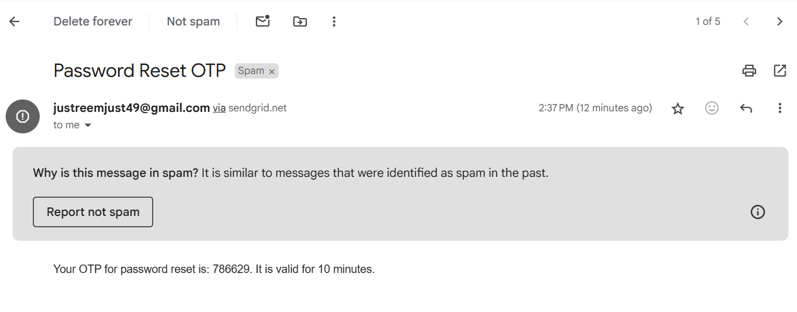

🔒 Forgot Password with OTP in Node.js & SendGrid 🔐

I’m excited to share that I’ve added a “Forgot Password” feature to my Node.js project, using OTP (One-Time Password) for extra security! 🚀 Here’s a quick overview of how it works:

How It Works:
Password Reset Request:

The user submits their email to reset their password.
A random 6-digit OTP is generated for security.
Sending OTP via Email:

I used SendGrid to send the OTP to the user’s email 📧.
The email tells the user the OTP is valid for 10 minutes.
Verifying OTP:

The user enters the OTP, which is checked against what’s stored in the database.
If valid and not expired, they can reset their password.
Password Reset:

The user provides a new password, which is encrypted and updated in the database.
Tech Stack:
Node.js 🟩
Express.js 🛠️
SendGrid 📧
MongoDB 🗄️
CryptoJS 🔒
Testing:
I tested it using Postman, and everything worked perfectly—OTP was sent successfully, and the password reset was smooth! 😎
Feel free to reach out if you have questions or want more details on how I implemented it! 😊
